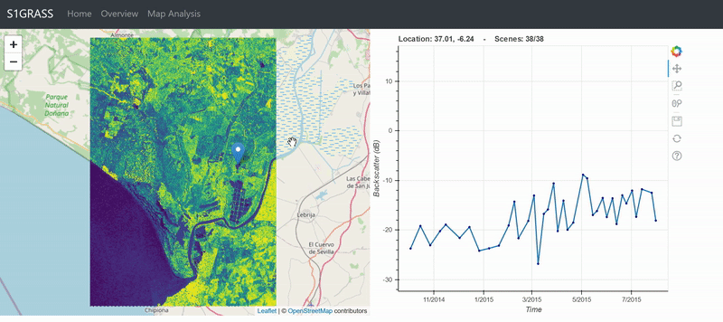

This Flask application with GRASS GIS integration was developed for the module GEO450 of the M.Sc. Geoinformatics at the
Friedrich-Schiller-University Jena.

bla

### Setup / Requirements

- Install a stable version of [GRASS GIS (7.8.*)](https://grass.osgeo.org/download/)
- Download / Clone this repository
- Open `config.py` and update the variable `data_dir` with the location of your GeoTIFF files
    - Note: The file naming scheme used by [pyroSAR](https://github.com/johntruckenbrodt/pyroSAR) is expected. A different naming 
    scheme will lead to some of the extracted metadata to not make sense or it will lead to an error during initialization 
    of the application. (For more information about pyroSAR's naming scheme see [here](https://pyrosar.readthedocs.io/en/latest/general/filenaming.html) or [here](https://www.researchgate.net/profile/John_Truckenbrodt/publication/334258406_PYROSAR_A_FRAMEWORK_FOR_LARGE-SCALE_SAR_SATELLITE_DATA_PROCESSING/links/5d1f4071a6fdcc2462c1ff1b/PYROSAR-A-FRAMEWORK-FOR-LARGE-SCALE-SAR-SATELLITE-DATA-PROCESSING.pdf))
- Open terminal (on Windows 'Anaconda Prompt' is recommended to use Conda) and navigate to the repository
- Set up and activate a Conda environment:
    - `conda env create -f environment.yml`
    - `conda activate S1GRASS_env`
- Use `flask run` to start the local deployment
- Open the link suggested by Flask in your browser (should be `http://localhost:5000/` by default). This will trigger 
the initialization of the backend (SQLite & GRASS). Open the terminal again to see what's going on in the background. 
The application will load in the browser once the backend finished doing its thing. 

### Preview

### 